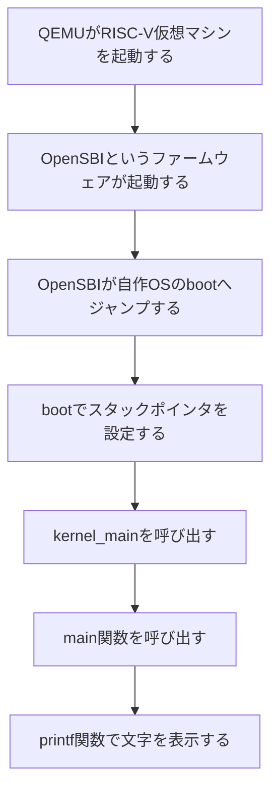
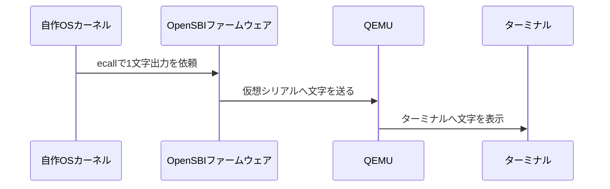

# 99行で作るOS自作

普段書いているC言語のプログラムで疑問に思ったことはないでしょうか？

- `#include <stdio.h>`で使われる標準ライブラリの実体は、どこにあるのか？
- `main`関数が呼ばれるまで、誰がどんなことをしているのか？
- `printf`関数は、どうやって文字を画面に出しているのか？

今回の演習では、RISC-VというCPU向けの小さなOSを作り、QEMU上で実際にOSを起動して最初のプログラムを実行します。入力待ち、タイマー待ち、終了処理を実装して、最低限のOSを完成させます。

今回作るのは、OSの中心部分にあたるカーネルとライブラリの一部で、LinuxやmacOSのような本格的なOSではありません。ファイルシステム、プロセス管理、メモリ保護、シェルなどの機能は作りません。

普段はOSや標準ライブラリが隠してくれている部分を実際に小さい形で作ってみて、以下のことについて理解を深めます。

- `main` 関数は、誰かが自動で呼んでくれるものではなく、呼び出すための仕組みがOSに必要だということ
- `printf` が使えない環境では、`stdio.h` の裏側にある処理を自分で用意する必要があること
- OSが起動する前にファームウェアを呼び出して、文字出力や入力などの処理を進めること

本演習はnutaさんによる「1000行でOSを作ってみよう」をベースにしています。時間の都合で、OSブートと標準ライブラリの小さな自作までに絞っていますが、余裕があれば、ぜひオリジナルの1000行版にも挑戦してみてください。

参考文献：https://github.com/nuta/operating-system-in-1000-lines

## 用語

### RISC-Vとは

RISC-V（リスクファイブ）は、CPUの命令セットアーキテクチャ（ISA）です。仕様が公開されていて、ライセンス料なしで使えるため、組み込み機器から開発用チップまでいろいろな場面で使われています。
RISC-Vが載った開発ボードには、Linuxが動くものもありますが、一人一台の実機を用意するのは大変です。そこで今回は「QEMU」という仮想マシンを使います。
QEMUは、実物のハードウェアがなくても、ソフトウェアでCPUや周辺機器の動きを再現できます。CPUの命令もソフトウェアで処理するので、実機ほど速くはありませんが、自作OSを開発して実際に動かすには大変便利な存在です。

### OS

OSは、オペレーティングシステムの略で、コンピュータ全体を管理するプログラムのまとまりを指します。LinuxやmacOSのようなものです。
本物のOSには、カーネル、ファイルシステム、プロセス管理、メモリ管理、デバイスドライバ、シェルなど、いろいろな部品が含まれますが、この演習では本格的なOS全体は作りません。
作るのは、その中でも起動直後に動く小さなカーネルです。

### カーネル

カーネルは、OSの中心部分です。CPU、メモリ、入出力装置などハードウェアとのやりとりを直接扱うプログラムです。

### ファームウェア

ファームウェアは、ハードウェアとカーネルの間に位置する、起動時に最初に動くプログラムです。
コンピュータの電源が入ると、CPUはすぐにカーネルを実行するわけではありません。まず、あらかじめ決められた位置から最初の命令を読み出し、ハードウェアの初期化や起動準備を行います。この段階で動作するプログラムがファームウェアです。

今回の演習環境では、OpenSBIがファームウェアの役割に相当します。QEMU上で仮想的なRISC-Vマシンを起動すると、最初にOpenSBIが実行されます。OpenSBIは、CPUの動作モードや割り込み、タイマなど、カーネルが動き始めるために必要な準備を行い、そのあと今回作成するカーネルへ制御を渡します。

### アプリケーション

アプリケーションは、OSの上で動く普通のプログラムです。
たとえば、macOSやLinux上で実行するC言語のプログラムはアプリケーションです。アプリケーションでは、OSや標準ライブラリが前もって準備をしてくれるため、`main` 関数から自然に書き始めることができます。

### 上、下という表現について

この資料では、説明を簡単にするために「上」「下」「低い」という表現を使うことがあります。

- アプリケーションは、OSの上で動く
- カーネルは、アプリケーションより低い層で動く
- OpenSBIは、カーネルより前に起動するファームウェアである
- カーネルは、SBIを使ってOpenSBIに処理を依頼する

これは厳密な階層というよりかは、起動順や処理を依頼する向きを説明するための言い方になります。基本的には以下の順番の流れです。

```text
ハードウェア（仮想マシンQEMU）
  → ファームウェア（OpenSBI）
    → カーネル（自作するOS）
      → アプリケーション（main関数）
````


## OSの役割

### プログラムはどうやって実行されているか

普段実行しているC言語のプログラムは、OSの上で動くアプリケーションです。

アプリケーションでは、`main` 関数が呼ばれる前に、OSや標準ライブラリが次のような準備をしてくれています。

* プログラムをメモリに読み込む
* スタックなどのメモリ領域を用意する
* 標準入力や標準出力を使えるようにする
* `printf` などの標準ライブラリ関数を使える状態にする
* 最後に `main` 関数を呼び出す

そのため、私たちは普段OSを意識しなくても、以下のようなコードを書くことができます。

```c
#include <stdio.h>

void main() {
    printf("Hello, world!\n");
    return 0;
}
```

このコードでは、`main` 関数が最初から存在しているように見えますが、実際には、`main` を呼び出すための処理がOSのカーネル内にあります。

カーネルが動き始める時点では、まだ通常のOS環境はありません。標準入力も標準出力もありません。`printf` もありません。`main` 関数を勝手に呼んでくれる仕組みもありません。

OSが起動してから`main` 関数が呼ばれるまでOSのカーネル内で実行されているものを自分で作ってみます。

```text
boot
  → kernel_main
    → main
```

これらの呼び出しの仕組みを作ることで、普段は見えない `main` 関数の呼び出され方を学ぶことができます。

### OSが起動する流れ

今回の構成では、実機ではなくQEMUというエミュレータを使います。QEMUは、仮想的なRISC-Vマシンを用意してくれます。

その仮想マシン上で、まずOpenSBIというファームウェアが起動します。詳細はあとで説明しますが、OpenSBIは、RISC-V環境でOSを起動する前に必要な処理を行い、その後、自作OSへ制御を渡します。

全体の流れは以下になります。



普通のCプログラムでは、実行すると `main` 関数から始まりますが、OS内のカーネルではそうはいきません。

今回のカーネルでは、まず `boot` という入口から処理が始まります。そこでスタックポインタを設定し、その後 `kernel_main` を呼び出します。`kernel_main` の中で、ようやくC言語で書いた `main` 関数を呼び出します。

今回の演習では「`main` がどうやって呼ばれているのか」を、自分で作って確認します。

### 演習のファイル構成

作業フォルダには、以下のファイルを作成します。

```text
os99
├── boot.ld
├── kernel.c
├── main.c
├── stdio.h
├── printf.c
└── run.sh
```

それぞれの役割は次の通りです。

* `boot.ld`: カーネルをメモリ上のどこに置くかを決めるリンカスクリプト
* `kernel.c`: 起動処理、SBI呼び出し、文字入出力、待機、終了処理
* `main.c`: OSの上で実行するアプリケーション
* `stdio.h`: `putchar`、`getchar`、`printf`などの関数宣言
* `printf.c`: 小さな`printf`の実装（標準ライブラリが提供する機能の一部）
* `run.sh`: ビルドしてQEMUで実行するスクリプト

## 準備

### 作業フォルダを作る

ターミナルを開き、作業用フォルダ `os99` を作成して、カレントディレクトリを移動します。

```bash
mkdir os99
cd os99
```

次にエディタを起動して現在のフォルダを開きます。

```
code .
```

ここで `code` は、VS Codeを起動するためのコマンドです。VS Codeが開いたら、以降はターミナルで `code ファイル名` を実行してファイルを編集します。

VS Codeを使っていない場合は、以降の資料に出てくる code を自分が普段使っているエディタ（例：vim、emacs、nanoなど）に読み替えて進めてください。

### 必要なソフトウェアを入れる

macOSではHomebrewを使って、LLVM/LLDとQEMUをインストールします。

```bash
brew install llvm lld qemu
```

RISC-Vに対応した`clang`は `/opt/homebrew/opt/llvm/bin/clang` にインストールされます。

今回の `run.sh` ではそのパスを使います。

## 演習1：最小の実行環境を作る

最初はOSの本体を作る前に、QEMUでRISC-Vの仮想マシンを起動できるかだけ確認します。まだ自作OSは動かしません。OpenSBIというファームウェアの起動画面が出れば成功です。

### run.shを作る

```bash
code run.sh
```

次の内容を書きます。

```bash
#!/bin/bash
set -xue
QEMU=qemu-system-riscv32
$QEMU -machine virt -bios default -nographic -serial mon:stdio --no-reboot
```

ファイルを保存したら、実行権限を付けます。

```bash
chmod +x run.sh
```

実行します。

```bash
./run.sh
```

### 確認すること

ターミナルに `OpenSBI` という大きな表示が出れば成功です。長いメッセージが表示されるので上にスクロールしないと`OpenSBI`の表示は見えないかもしれません。

```text
+ QEMU=qemu-system-riscv32
+ qemu-system-riscv32 -machine virt -bios default -nographic -serial mon:stdio --no-reboot

OpenSBI v1.7
   ____                    _____ ____ _____
  / __ \                  / ____|  _ \_   _|
 | |  | |_ __   ___ _ __ | (___ | |_) || |
 | |  | | '_ \ / _ \ '_ \ \___ \|  _ < | |
 | |__| | |_) |  __/ | | |____) | |_) || |_
  \____/| .__/ \___|_| |_|_____/|____/_____|
        | |
        |_|

Platform Name               : riscv-virtio,qemu
Platform Features           : medeleg
Platform HART Count         : 1
Platform IPI Device         : aclint-mswi
Platform Timer Device       : aclint-mtimer @ 10000000Hz
Platform Console Device     : uart8250
 :
 :（長いので省略）
 :
Boot HART ID                : 0
Boot HART Domain            : root
Boot HART Priv Version      : v1.12
Boot HART Base ISA          : rv32imafdch
Boot HART ISA Extensions    : sstc,zicntr,zihpm,zicboz,zicbom,sdtrig,svadu
Boot HART PMP Count         : 16
Boot HART PMP Granularity   : 2 bits
Boot HART PMP Address Bits  : 32
Boot HART MHPM Info         : 16 (0x0007fff8)
Boot HART Debug Triggers    : 2 triggers
Boot HART MIDELEG           : 0x00001666
Boot HART MEDELEG           : 0x00f4b509
```

QEMUを終了するには、次のキー操作をします。

```text
Ctrl + A を押したあとに X
```

または、`Ctrl + A` のあとに `C` を押してQEMUモニタに入り、`q` と入力して終了することもできます。

それでも終了できない場合は、別で新しくターミナルを開いて以下のコマンドを実行してQEMUを強制終了してください。

```bash
killall qemu-system-riscv32
```

### 何が起きたか

この段階では、OSはまだ存在しません。QEMUがRISC-Vの仮想マシンを作り、OpenSBIというファームウェアだけが起動しています。

* `nographic` を指定しているので、QEMUの別ウィンドウは開きません。ターミナルがそのまま仮想マシンの画面になります。
* `serial mon:stdio` は、標準入出力を仮想マシンのシリアルポートとQEMUモニタに接続する指定です。カーネル開発では、最初に画面描画を作るのは大変です。まずはシリアル出力に文字を出します。

### わざとファームウェアなしで起動してみる

`run.sh` の最後の行を一時的に変更してみます。

```bash
$QEMU -machine virt -bios default -nographic -serial mon:stdio --no-reboot
```

ここの `-bios default` を `-bios none` に修正します。

```bash
$QEMU -machine virt -bios none -nographic -serial mon:stdio --no-reboot
```

保存して実行します。

```bash
./run.sh
```

前と違って、以下の2行が表示されたままになるはずです。OpenSBIというファームウェアが呼ばれていません。

```text
+ QEMU=qemu-system-riscv32
+ qemu-system-riscv32 -machine virt -bios none -nographic -serial mon:stdio --no-reboot
```

QEMUを終了するには、次のキー操作をします。

```text
Ctrl + A を押したあとに X
```

### 何が起きたか

QEMUは、実物のRISC-VボードをPC上で再現するソフトです。

```text
実機のRISC-Vボード
  → 電源を入れると、最初にファームウェアが動く

QEMUのRISC-V仮想マシン
  → 起動すると、最初に何を動かすかをオプションで選べる
```

その「最初に何を動かすか」を指定するのが、`-bios` オプションです。

`default` は「最初に標準のファームウェアを起動してください」という意味です。

RISC-Vの `virt` マシンでは、標準ファームウェアとしてOpenSBIが使われます。

OpenSBIのソースコードは、GitHubリポジトリで公開されています。
https://github.com/riscv-software-src/opensbi

HomebrewでインストールしたQEMUには、ビルド済みのOpenSBIファームウェアが同梱されています。RISC-V 32bit用のファームウェアの場所は以下のコマンドで確認できます。

```bash
ls /opt/homebrew/share/qemu/opensbi-*.bin
```

```text
/opt/homebrew/share/qemu/opensbi-riscv32-generic-fw_dynamic.bin
/opt/homebrew/share/qemu/opensbi-riscv64-generic-fw_dynamic.bin
```

QEMUではない実物のRISC-Vボードでは、microSDカードや基板上のFlashにファームウェアが書き込まれていて、電源投入時にそこに書かれている内容が最初に実行されます。
具体的なRISC-Vボードの例としてMilk-V Duoという製品では、OpenSBIを含んだファームウェアをmicroSDカードのFATパーティションに書き込んで起動します。
他のRISC-Vボードでは、基板上のFlashやeMMCに書き込まれていることもあります。

## 演習2：自作OSを起動する

ここから、自作OSをQEMUで起動します。まだ文字は出しません。OSが起動して、何もせず停止し続けるところまで作ります。

### リンカスクリプト boot.ld を作る

codeコマンドを実行して`boot.ld` ファイルを作ります。

```bash
code boot.ld
```

リンカスクリプト（13行）を書きます。

```ld
ENTRY(boot)

SECTIONS {
    . = 0x80200000;
    .text   : { KEEP(*(.text.boot)) *(.text .text.*) }
    .rodata : ALIGN(4) { *(.rodata .rodata.*) }
    .data   : ALIGN(4) { *(.data .data.*) }
    .bss    : ALIGN(4) {
        __bss = .; *(.bss .bss.* .sbss .sbss.*); __bss_end = .;
    }
    . = ALIGN(4) + 128K;
    __stack_top = .;
}
```

### 各行の意味

`. = 0x80200000;` は、カーネルをメモリ上の 0x80200000 番地から配置するという意味です。OpenSBIは、この場所にカーネルがある前提で制御を渡します。配置場所がずれていると、CPUは正しい命令を実行できません。この行は、OpenSBIから正しく起動してもらうために、カーネルの置き場所を指定している設定です。

`.text` は、CPUが実行する命令、つまりプログラム本体を置く領域です。起動直後に必要な .text.boot を先に配置し、KEEP によって不要なコードとして削除されないようにしています。そのあとに、通常の .text や .text.* に含まれる処理をまとめて配置します。

`.rodata` は、読み取り専用のデータを置く領域です。文字列定数や変更しない定数データなどがここに配置されます。ALIGN(4) によって、4バイト境界にそろえて配置します。

`.data` は、初期値のあるグローバル変数や静的変数を置く領域です。たとえば、最初から値が決まっている変数がここに配置されます。こちらも ALIGN(4) によって、4バイト境界にそろえて配置します。

`.bss` は、初期値のないグローバル変数や静的変数を置く領域です。ここに置かれる変数は、カーネル起動時に0で初期化します。__bss は .bss 領域の開始位置、__bss_end は .bss 領域の終了位置を表します。

`__stack_top` は、スタックの一番上の位置を表すラベルです。`.bss` のあとに 128Kバイトの領域を確保し、その末尾をスタックの開始位置として使います。RISC-Vではスタックは高いアドレスから低いアドレスへ伸びるため、この位置をスタックポインタに設定します。

### カーネル kernel.c を作る

codeコマンドを実行して`kernel.c` ファイルを作ります。

```bash
code kernel.c
```

まずは、最小版のカーネル（17行）を書きます。

```c
extern char __stack_top[];

void kernel_main(void) {
    for (;;) {
        __asm__ __volatile__("wfi");
    }
}

__attribute__((section(".text.boot"), naked))
void boot(void) {
    __asm__ __volatile__(
        "mv sp, %[stack_top]\n"
        "j kernel_main\n"
        :
        : [stack_top] "r" (__stack_top)
    );
}
```

### run.sh をカーネル起動用にする

codeコマンドを実行して`kernel.c` ファイルを編集します。

```bash
code run.sh
```

次のように変更します。

```bash
#!/bin/bash
set -xue
QEMU=qemu-system-riscv32
CC=/opt/homebrew/opt/llvm/bin/clang
CFLAGS="-std=c11 -O2 -g3 -Wall -Wextra --target=riscv32-unknown-elf -fuse-ld=lld -fno-stack-protector -ffreestanding -nostdlib"
$CC $CFLAGS -Wl,-Tboot.ld -Wl,-Map=os.map -o os.elf kernel.c
$QEMU -machine virt -bios default -nographic -serial mon:stdio --no-reboot -kernel os.elf
```

実行します。

```bash
./run.sh
```

### 実行結果

OpenSBIの表示が出たあと、停止した状態になります。これは正しい動作です。

カーネルの `kernel_main` に入り、`wfi` 命令を含む無限ループで止まり続けています。

QEMUを終了するには、`Ctrl + A` を押したあとに `X` を押します。

## 演習3：Hello, my kernel! を表示する

カーネルが起動した後に文字を表示するようにします。

### kernel.c を拡張する

codeコマンドを実行して`kernel.c` ファイルを編集します。


```bash
code kernel.c
```

SBIを使って、カーネルから1文字ずつ文字を表示するコードに置き換えます（49行）。

```c
extern char __stack_top[];

void main(void);

struct sbiret {
    long error;
    long value;
};

struct sbiret sbi_call(long arg0, long arg1, long arg2, long arg3,
                       long arg4, long arg5, long fid, long eid) {
    register long a0 __asm__("a0") = arg0;
    register long a1 __asm__("a1") = arg1;
    register long a2 __asm__("a2") = arg2;
    register long a3 __asm__("a3") = arg3;
    register long a4 __asm__("a4") = arg4;
    register long a5 __asm__("a5") = arg5;
    register long a6 __asm__("a6") = fid;
    register long a7 __asm__("a7") = eid;
    __asm__ __volatile__("ecall"
        : "+r"(a0), "+r"(a1)
        : "r"(a2), "r"(a3), "r"(a4), "r"(a5), "r"(a6), "r"(a7)
        : "memory");
    return (struct sbiret){a0, a1};
}

void putchar(char ch) {
    sbi_call(ch, 0, 0, 0, 0, 0, 0, 1);
}

void kernel_main(void) {
    const char *message = "\n\nHello, my kernel!\n";
    for (int i = 0; message[i] != '\0'; i++) {
        putchar(message[i]);
    }
    for (;;) {
        __asm__ __volatile__("wfi");
    }
}

__attribute__((section(".text.boot"), naked))
void boot(void) {
    __asm__ __volatile__(
        "mv sp, %[stack_top]\n"
        "j kernel_main\n"
        :
        : [stack_top] "r" (__stack_top)
    );
}
```

実行します。

```bash
./run.sh
```

### 実行結果

OpenSBIのログのあとに、以下のメッセージが表示されます。

```text
Hello, my kernel!
```

おめでとうございます。

QEMUを終了するには、`Ctrl + A` を押したあとに `X` を押します。

### 何が起きたか

`putchar` は1文字を表示する関数です。ただし、自分で画面のメモリを書き換えているわけではありません。

```c
void putchar(char ch) {
    sbi_call(ch, 0, 0, 0, 0, 0, 0, 1);
}
```

この関数は、`sbi_call` に文字を渡しています。`sbi_call` の中では、RISC-Vのレジスタ `a0` から `a7` に引数を入れ、`ecall` 命令でOpenSBIを呼び出します。

```c
__asm__ __volatile__("ecall"
    : "+r"(a0), "+r"(a1)
    : "r"(a2), "r"(a3), "r"(a4), "r"(a5), "r"(a6), "r"(a7)
    : "memory");
```

`ecall` は、実行中のプログラムが「自分より高い権限を持つ実行環境」に処理を依頼するための命令です。RISC-Vでは、このような呼び出しを環境呼び出しと呼びます。

### RISC-Vの特権モード

RISC-Vには、プログラムを実行するときの権限レベルがあります。
この権限レベルを Privilege Mode、特権モードと呼びます。

| モード | 名前            | 主な利用者                | 権限 |
| ------ | --------------- | ------------------------- | ---- |
| M-mode | Machine mode    | ファームウェア、OpenSBI   | 最高 |
| S-mode | Supervisor mode | OSカーネル、Linux、自作OS | 高い |
| U-mode | User mode       | 一般のアプリケーション    | 低い |

今回のプログラムでは、OSカーネルがSBIという仕組みを使って、OpenSBIのファームウェアに文字出力を依頼しています。カーネル自身が直接macOSの画面に文字を書いているわけではありません。カーネルは `ecall` を実行し、OpenSBIに「この文字を出力してほしい」と依頼します。

### SBIとは

SBIは、Supervisor Binary Interfaceの略です。RISC-Vで動くOSのカーネルが、M-modeで動作するファームウェアに処理を頼むための標準的なインターフェースです。OpenSBIは、このSBIを実装したオープンソースのファームウェアです。

今回使っている呼び出しは、古い形式のLegacy SBIです。Legacy SBIでは、`a7` レジスタに入れる値によって、どの処理を呼び出すかが決まります。

| `a7` | 名前                       | 役割          | 簡単な説明                   |
| ---: | ------------------------ | ----------- | ----------------------- |
|  `0` | `set_timer`              | タイマー設定      | 次にタイマー割り込みを起こす時刻を設定する   |
|  `1` | `console_putchar`        | 1文字出力       | 文字を1文字コンソールへ出す          |
|  `2` | `console_getchar`        | 1文字入力       | コンソールから1文字読む            |
|  `3` | `clear_ipi`              | IPIクリア      | 他コアからの割り込みをクリアする        |
|  `4` | `send_ipi`               | IPI送信       | 他のhart、つまりCPUコアへ割り込みを送る |
|  `5` | `remote_fence_i`         | 命令キャッシュ同期   | 他コアで `fence.i` を実行させる   |
|  `6` | `remote_sfence_vma`      | TLB同期       | 他コアの仮想メモリ変換キャッシュを同期する   |
|  `7` | `remote_sfence_vma_asid` | ASID付きTLB同期 | 特定ASIDについてTLB同期する       |
|  `8` | `shutdown`               | 電源終了        | QEMUや実機をシャットダウンする       |

たとえば、次のコードは1文字を出力するための関数です。

```c
void putchar(char ch) {
    sbi_call(ch, 0, 0, 0, 0, 0, 0, 1);
}
```

このとき、最後の引数 `1` が `a7` レジスタに入ります。`a7 = 1` はLegacy SBIの `console_putchar` を表すため、OpenSBIは `a0` に入っている文字をコンソールへ出力します。

文字を表示したいとき、カーネルは直接コンソールの画面に文字を書いているわけではありません。次のような流れで文字を表示しています。



ちなみに、現在のSBIではLegacy SBIではなく、`a7` に拡張ID、`a6` に関数IDを入れる新しい方式が使われます。自作OSの最初の段階で1文字出力を試す場合は、Legacy SBIの `console_putchar` を使うと仕組みを理解しやすいです。

## 演習4：printfを使えるようにする

1文字ずつ表示できるようになったので、次は小さな `printf` 関数を作ります。`printf`があると、数値や文字列を確認しやすくなります。OS開発では、画面に少しでも情報を出せるだけで、デバッグがしやすくなります。

ここで作る `stdio.h` は、普段使っている標準Cライブラリの `stdio.h` とは別物です。名前は同じですが、中身は今回のOS用に自分で用意します。

### 標準入出力ヘッダ stdio.h を作る

codeコマンドを実行して`stdio.h` ファイルを作ります。


```bash
code stdio.h
```

次のプロトタイプ宣言を書きます（2行）。

```c
void putchar(char ch);
void printf(const char *fmt, ...);
```

最初は `putchar` と `printf` の宣言だけを書きます。あとで入力の `getchar` の宣言もこのファイルに追加します。

### printf.c を作る

codeコマンドを実行して`printf.c` ファイルを作ります。


```bash
code printf.c
```

`printf`関数の小さい実装を書きます（36行）。

```c
#include "stdio.h"

void printf(const char *fmt, ...) {
    __builtin_va_list ap;
    __builtin_va_start(ap, fmt);
    while (*fmt) {
        if (*fmt != '%') {
            putchar(*fmt++);
            continue;
        }
        fmt++;
        if (*fmt == 's') {
            const char *s = __builtin_va_arg(ap, const char *);
            while (*s) putchar(*s++);
        } else if (*fmt == 'c') {
            putchar(__builtin_va_arg(ap, int));
        } else if (*fmt == 'd') {
            int n = __builtin_va_arg(ap, int);
            unsigned x = n, d = 1;
            if (n < 0) putchar('-'), x = -x;
            while (x / d >= 10) d *= 10;
            while (d) putchar('0' + x / d), x %= d, d /= 10;
        } else if (*fmt == 'x') {
            unsigned x = __builtin_va_arg(ap, unsigned);
            for (int i = 28; i >= 0; i -= 4)
                putchar("0123456789abcdef"[(x >> i) & 15]);
        } else if (*fmt == '%') {
            putchar('%');
        } else {
            putchar('%');
            putchar(*fmt);
        }
        fmt++;
    }
    __builtin_va_end(ap);
}
```

この`printf` で対応している書式は以下になります。

- `%s` は文字列を出力します。引数には `const char *` 型の文字列を渡します。
- `%c` は1文字を出力します。引数には `int` 型として渡された一つの文字を使います。
- `%d` は符号付き10進整数を出力します。引数には `int` 型の整数を渡します。負の数の場合は先頭に `-` が付きます。
- `%x` は符号なし整数を16進数で出力します。引数には `unsigned` 型の整数を渡します。出力は小文字の16進数で、常に8桁になります。
- `%%` は `%` そのものを出力します。この書式では追加の引数は不要です。
- `%` で始まらない通常の文字は、そのまま出力されます。
- 上記以外の書式は未対応です。たとえば小数点の `%f` は変換されず、`%f` のまま出力されます。

### main.c を作る

codeコマンドを実行して`main.c` ファイルを作ります。

```bash
code main.c
```

RISC-V 32bit環境でハローワールドするC言語プログラムを書きます（5行）。

```c
#include "stdio.h"

void main(void) {
    printf("\n\nHello, %s-%c %d!\n", "RISC", 'V', 32);
}
```

### kernel.c を修正する

codeコマンドを実行して`kernel.c` ファイルを修正します。

```bash
code kernel.c
```

`kernel_main`を、`main`を呼び出す形に修正します（-4行、+1行）。


修正前：
```c
void kernel_main(void) {
    const char *message = "\n\nHello, my kernel!\n";
    for (int i = 0; message[i] != '\0'; i++) {
        putchar(message[i]);
    }
    for (;;) {
        __asm__ __volatile__("wfi");
    }
}
```

修正後：
```c
void kernel_main(void) {
    main();
    for (;;) {
        __asm__ __volatile__("wfi");
    }
}
```

### run.sh を完成版にする

codeコマンドを実行して`run.sh` ファイルを修正します。

```bash
code run.sh
```

今まで作ったすべてのファイルをコンパイル対象に含めます。

```bash
#!/bin/bash
set -xue
QEMU=qemu-system-riscv32
CC=/opt/homebrew/opt/llvm/bin/clang
CFLAGS="-std=c11 -O2 -g3 -Wall -Wextra --target=riscv32-unknown-elf -fuse-ld=lld -fno-stack-protector -ffreestanding -nostdlib"
$CC $CFLAGS -Wl,-Tboot.ld -Wl,-Map=os.map -o os.elf kernel.c printf.c main.c
$QEMU -machine virt -bios default -nographic -serial mon:stdio --no-reboot -kernel os.elf
```

実行します。

```bash
./run.sh
```

### 実行結果

```text
Hello, RISC-V 32!
```

QEMUを終了するには、`Ctrl + A` を押したあとに `X` を押します。

### 解説：printf の読み方

`printf`は、文字列を先頭から1文字ずつ読みます。

```c
while (*fmt) {
```

`%`ではない文字は、そのまま出します。

```c
if (*fmt != '%') { putchar(*fmt++); continue; }
```

`%s`なら文字列、`%c`なら1文字、`%d`なら10進数、`%x`なら16進数として出力します。

```c
if (*fmt == 's') {
    for (char *s = __builtin_va_arg(ap, char *); *s; s++) putchar(*s);
} else if (*fmt == 'c') {
    putchar(__builtin_va_arg(ap, int));
}
```

`__builtin_va_list`、`__builtin_va_start`、`__builtin_va_arg`、`__builtin_va_end`は、可変長引数を扱うためのコンパイラ組み込み機能です。Cの標準ライブラリ（libc）がない環境でも、コンパイラ側の機能として使えます。

### printf を強くする

最初に作った `printf` は、単純な`%d`の書式には対応していますが、`%08X`や`%10d`、`%*s`などの書式にはまだ対応できていません。

`main.c`を次のように変えてみます。

```c
#include "stdio.h"

void main(void)
{
    int a[] = { 115, 255, 256, 4660, 43981, 305419896, 2147483647};
    printf("\n%*s      hex\n", 10, "decimal");
    printf("--------------------------\n");
    for (int i = 0; i < 7; i++) {
        printf("%10d  ->  0x%08X\n", a[i], a[i]);
    }
}
```

実行します。

```bash
./run.sh
```

以下のような表示となり、書式がうまく変換されないはずです。

```text
%*s      hex
--------------------------
%10d  ->  0x%08X
%10d  ->  0x%08X
%10d  ->  0x%08X
%10d  ->  0x%08X
%10d  ->  0x%08X
%10d  ->  0x%08X
%10d  ->  0x%08X
```

QEMUを終了するには、`Ctrl + A` を押したあとに `X` を押します。

`printf.c`を次のように書き変えてみましょう（39行）。

```c
#include "stdio.h"

void printf(const char *fmt, ...) {
    __builtin_va_list ap;
    __builtin_va_start(ap, fmt);
    while (*fmt) {
        if (*fmt != '%') { putchar(*fmt++); continue; }
        fmt++;
        char pad = (*fmt == '0') ? *fmt++ : ' ';
        int width = 0;
        if (*fmt == '*') { width = __builtin_va_arg(ap, int), fmt++; }
        else { while ('0' <= *fmt && *fmt <= '9') width = width * 10 + *fmt++ - '0'; }
        if (*fmt == 's') {
            char *s = __builtin_va_arg(ap, char *);
            int len = 0;
            while (s[len]) len++;
            while (len < width) putchar(pad), width--;
            while (*s) putchar(*s++);
        } else if (*fmt == 'c') {
            putchar(__builtin_va_arg(ap, int));
        } else if (*fmt == 'd' || *fmt == 'x' || *fmt == 'X') {
            unsigned x; char buf[16]; int i = 0, base = (*fmt == 'd') ? 10 : 16;
            char *digits = (*fmt == 'X') ? "0123456789ABCDEF" : "0123456789abcdef";
            if (*fmt == 'd') {
                int n = __builtin_va_arg(ap, int);
                if (n < 0) putchar('-'), n = -n, width--;
                x = n;
            } else x = __builtin_va_arg(ap, unsigned);
            do buf[i++] = digits[x % base], x /= base; while (x);
            while (i < width) putchar(pad), width--;
            while (i--) putchar(buf[i]);
        } else {
            if (*fmt != '%') putchar('%');
            putchar(*fmt);
        }
        fmt++;
    }
    __builtin_va_end(ap);
}
```

実行します。

```bash
./run.sh
```

こんな表示になれば成功です。

```text
   decimal      hex
--------------------------
       115  ->  0x00000073
       255  ->  0x000000FF
       256  ->  0x00000100
      4660  ->  0x00001234
     43981  ->  0x0000ABCD
 305419896  ->  0x12345678
2147483647  ->  0x7FFFFFFF
```

新しく追加した書式は以下の通りです。

- `%` の直後に数字を書くと、最小幅を指定できます。たとえば `%5d` は、5文字幅になるように左側を空白で埋めます。
- `%` の直後に `0` を書くと、空白ではなく `0` で埋めます。たとえば `%05d` は、5文字幅になるように左側を `0` で埋めます。
- 幅指定に `*` を使うと、幅を引数から受け取ります。たとえば `%*s` では、最初の引数で幅のサイズを指定し、次の引数で出力する文字列を指定します。

```c
printf("\n%*s      hex\n", 10, "decimal");
```

この `printf` は、`"decimal"` という文字列を幅10文字で右寄せして表示して、そのあとに`"      hex\n"` を表示するという意味になります。

QEMUを終了するには、`Ctrl + A` を押したあとに `X` を押します。

### 失敗してみよう

`run.sh` の下から2行目を、いったん壊してみます。

以下のように修正して、コンパイル対象から`printf.c` を一時的に消します。

修正前：
```bash
$CC $CFLAGS -Wl,-Tboot.ld -Wl,-Map=os.map -o os.elf kernel.c printf.c main.c
```

修正後：
```bash
$CC $CFLAGS -Wl,-Tboot.ld -Wl,-Map=os.map -o os.elf kernel.c main.c
```

この状態で実行します。

```bash
./run.sh
```

おそらく `printf` が見つからないという意味のエラーが出ます。

```text
ld.lld: error: undefined symbol: printf
>>> referenced by main.c:6 (/Users/takesako/os99/main.c:6)
>>>               /var/folders/dv/ppvb9hb55qld8d6x1k190q3r0000gn/T/main-1ff37c.o:(main)
clang: error: linker command failed with exit code 1 (use -v to see invocation)
```

エラーの中に「ld.lld: error: undefined symbol: printf」という行があります。`stdio.h` に宣言を書いただけでは、`printf` 関数の中身が見つからないということです。`printf.c` も一緒にコンパイルしてリンクする必要があります。

確認できたら、`run.sh` をもとに修正して`printf.c` をコンパイル対象に戻します。

```bash
#!/bin/bash
set -xue
QEMU=qemu-system-riscv32
CC=/opt/homebrew/opt/llvm/bin/clang
CFLAGS="-std=c11 -O2 -g3 -Wall -Wextra --target=riscv32-unknown-elf -fuse-ld=lld -fno-stack-protector -ffreestanding -nostdlib"
$CC $CFLAGS -Wl,-Tboot.ld -Wl,-Map=os.map -o os.elf kernel.c printf.c main.c
$QEMU -machine virt -bios default -nographic -serial mon:stdio --no-reboot -kernel os.elf
```

### 何が起きたか

`stdio.h` に書いたのは、関数の宣言です。

```c
void printf(const char *fmt, ...);
```

これは、`printf` という関数がこのような可変長引数で存在します、という宣言だけを書いています。

実際の中身は `printf.c` にあります。コンパイル対象に `printf.c` を入れ忘れると、宣言はあるのに本体がない状態になり、リンク時にエラーになります。

## 演習5：getcharを追加して1文字入力する

次はキーボード入力を受け取ります。

最初は、キーが押されていないときにすぐ戻る `getchar_nonblock` を作ります。そのあと、キーが押されるまで待つ `getchar` を作ります。
`getchar_nonblock` は標準Cライブラリの関数ではありません。今回は、入力があるかどうかを試しやすくするために、演習用の関数として用意します。

### kernel.c に getchar_nonblock() を追加する

codeコマンドを実行して`kernel.c` ファイルを修正します。

```bash
code kernel.c
```

`putchar` 関数の下に、次の関数を追加します（+4行）。

```c
int getchar_nonblock(void) {
    struct sbiret ret = sbi_call(0, 0, 0, 0, 0, 0, 0, 2);
    return ret.error;
}
```

### stdio.hを更新する

codeコマンドを実行して`stdio.h` ファイルを修正します。

```bash
code stdio.h
```

`getchar_nonblock`の宣言を追加します。

```c
void putchar(char ch);
void printf(const char *fmt, ...);
int getchar_nonblock(void);
```

### main.cで試す

```bash
code main.c
```

```c
#include "stdio.h"

void main(void) {
    printf("\n\npress key check start\n");
    int ch = getchar_nonblock();
    printf("getchar_nonblock returned: %d\n", ch);
}
```

### 実行する

```bash
./run.sh
```

キーを押していない場合、次のように負の値が表示されます。

```text
press key check start
getchar_nonblock returned: -1
```

QEMUを終了するには、`Ctrl + A` を押したあとに `X` を押します。

### 何が起きたか

`getchar_nonblock` は、キーが入力されていれば文字コードを返します。入力がなければ、負の値を返します。このように、待たずにすぐ戻る処理を「ノンブロッキング」と呼びます。

このままだと、人間がキーを押す前にチェックが終わってしまいます。そこで、キーが押されるまで待つ `getchar` を作ります。

### kernel.c に getchar() を追加する

`getchar_nonblock` の下に以下の関数を追加します。

```c
int getchar(void) {
    int ch;
    while ((ch = getchar_nonblock()) < 0);
    return ch;
}
```

### stdio.h を更新する

```c
void putchar(char ch);
void printf(const char *fmt, ...);
int getchar_nonblock(void);
int getchar(void);
```

### main.cで1文字入力を試す

```c
#include "stdio.h"

void main(void) {
    printf("\n\npress any key: ");
    int ch = getchar();
    printf("\nyou typed: %c\n", ch);
}
```

### 実行する

```bash
./run.sh
```

表示されたあと、好きなキーを1つ押します。

```text
press any key: a
you typed: a
```

QEMUを終了するには、`Ctrl + A` を押したあとに `X` を押します。

### 何が起きたか

`getchar` は、内部で `getchar_nonblock` を何度も呼び出します。

```c
while ((ch = getchar_nonblock()) < 0) {}
```

入力がない間はループし、入力が来たらループを抜けます。

このように、結果が来るまで待つ処理を「ブロッキング」と呼びます。

## 演習6：待ち時間を追加する

少し待ってから表示する処理を作ります。

RISC-Vでは、現在の時刻カウンタを読む `rdtime` 命令を使えます。今回はこれを使って、ミリ秒待つ `msleep` を作ります。

### kernel.c に read_time() と msleep() を追加する

```c
long read_time(void) {
    long value;
    __asm__ __volatile__("rdtime %0" : "=r"(value));
    return value;
}

void msleep(int msec) {
    long start = read_time();
    while (read_time() - start < msec * 10000L);
}
```

### stdio.h を更新する

```c
void putchar(char ch);
void printf(const char *fmt, ...);
int getchar_nonblock(void);
int getchar(void);
long read_time(void);
void msleep(int msec);
```

### main.cで試す

```c
#include "stdio.h"

void main(void) {
    printf("\n\ncountdown\n");
    printf("3\n");
    msleep(1000);
    printf("2\n");
    msleep(1000);
    printf("1\n");
    msleep(1000);
    printf("go!\n");
}
```

### 実行する

```bash
./run.sh
```

1秒ごとに表示が進めば成功です。

QEMUを終了するには、`Ctrl + A` を押したあとに `X` を押します。

### 何が起きたか

`read_time` はCPUの時刻カウンタを読みます。

```c
__asm__ __volatile__("rdtime %0" : "=r"(value));
```

`msleep` は、開始時刻から指定した時間が経つまでループします。

```c
while (read_time() - start < msec * 10000L) {
}
```

ここでは、QEMU virtマシンのタイマが10MHzで動く想定で、1ミリ秒をおよそ10000カウントとして扱っています。

## 演習7：exitでQEMUを終了する

これまでは、プログラムが終わってもカーネルは無限ループで止まっていました。

QEMUのvirtマシンには、終了用の仕組みが用意されています。それを使って、`main` が終わったらQEMUも終了するようにします。

本来、`exit` は `stdlib.h` に宣言される関数です。今回はファイル数を増やさずに進めるため、演習用として `stdio.h` に宣言を書きます。

### kernel.c に exit() を追加する

`kernel_main` の手前に以下の `exit()` 関数を追加します。

```c
void exit(long status) {
    int code = status ? 0x3333 | (status << 16) : 0x5555;
    *(volatile int *)0x100000 = code;
    for (;;) {
        __asm__ __volatile__("wfi");
    }
}
```

### kernel_mainを変更する

変更前：

```c
void kernel_main(void) {
    main();
    for (;;) {
        __asm__ __volatile__("wfi");
    }
}
```

変更後：

```c
void kernel_main(void) {
    main();
    exit(0);
}
```

### stdio.h を更新する

```c
void putchar(char ch);
void printf(const char *fmt, ...);
int getchar_nonblock(void);
int getchar(void);
long read_time(void);
void msleep(int msec);
void exit(long status);
```

### main.cで試す

```c
#include "stdio.h"

void main(void) {
    printf("\n\nbye!\n");
}
```

### 実行する

```bash
./run.sh
```

`bye!` と表示されたあと、自動的にQEMUが終了すれば成功です。毎回キー操作で終了しなくてよくなるので、ここまで来るとかなり試しやすくなります。

### 何が起きたか

`0x100000` は、QEMU virtマシンのテスト用デバイスが置かれている特殊なアドレスです。

```c
*(volatile int *)0x100000 = code;
```

ここに決まった値を書き込むと、QEMUが終了します。

`volatile` は、このメモリ書き込みをコンパイラが勝手に消さないようにするために付けています。普通の変数ではなく、デバイスのメモリに命令を書き込んでいるからです。

## 演習8：コマンド入力を作る

ここまでで、文字出力、文字入力、待ち時間、終了処理が使えるようになりました。

最後に、それらを組み合わせてコマンド入力して対話するプログラムを作ります。

### main.c を作る

```c
#include "stdio.h"

void read_line(char *buf, int size) {
    int i = 0, ch;
    while (i < size - 1 && (ch = getchar()) != '\r' && ch != '\n') {
        buf[i++] = ch;
        putchar(ch);
    }
    putchar('\n');
    buf[i] = '\0';
}

int streq(const char *a, const char *b) {
    int i = 0;
    while (a[i] && b[i] && a[i] == b[i]) i++;
    return a[i] == b[i];
}

void main(void) {
    char cmd[32];
    printf("\n\ntype help\n");
    for (;;) {
        printf("kernel> ");
        read_line(cmd, sizeof(cmd));
        if (streq(cmd, "help")) {
            printf("commands: help, wait, echo, exit\n");
        } else if (streq(cmd, "wait")) {
            printf("waiting");
            for (int i = 0; i < 8; i++) {
                printf(".");
                msleep(500);
            }
            printf(" done\n");
        } else if (streq(cmd, "echo")) {
            char text[64];
            printf("type text: ");
            read_line(text, sizeof(text));
            printf("%s\n", text);
        } else if (streq(cmd, "exit")) {
            printf("bye!\n");
            exit(0);
        } else printf("unknown command: %s\n", cmd);
    }
}
```

### 実行する

```bash
./run.sh
```

次のように、対話的に入力してみます。最初は `help` を入力して使えるコマンドを見ます。

```text
type help
kernel> help
commands: help, wait, echo, exit
kernel> wait
waiting........ done
kernel> echo
type text: AAA
AAA
kernel> exx
unknown command: exx
kernel> exit
bye!
```

### 何が起きたか

このプログラムは、次の3つを組み合わせています。

* `read_line` で1行入力する（入力した文字をその都度表示）
* `streq` で入力されたコマンド名を比較する
* コマンドごとに処理を分ける

かなり小さいですが、対話シェルに近い形になっています。

本物のOSのシェルは、ファイルを探したり、別のプログラムを起動したりします。今回のカーネル上のプログラムはそこまではしません。それでも、入力を読み、命令として解釈し、処理を実行する流れは同じです。

## ここまでの完成コード

### boot.ld

```ld
ENTRY(boot)

SECTIONS {
    . = 0x80200000;
    .text   : { KEEP(*(.text.boot)) *(.text .text.*) }
    .rodata : ALIGN(4) { *(.rodata .rodata.*) }
    .data   : ALIGN(4) { *(.data .data.*) }
    .bss    : ALIGN(4) {
        __bss = .; *(.bss .bss.* .sbss .sbss.*); __bss_end = .;
    }
    . = ALIGN(4) + 128K;
    __stack_top = .;
}
```

### stdio.h

```c
void putchar(char ch);
void printf(const char *fmt, ...);
int getchar_nonblock(void);
int getchar(void);
long read_time(void);
void msleep(int msec);
void exit(long status);
```

この `stdio.h` は、今回の演習用に作る小さなヘッダです。標準Cライブラリの `stdio.h` をそのまま再現しているわけではありません。`exit` は本来 `stdlib.h` 側の関数ですが、今回は作りやすさを優先してここの1つのヘッダファイルにまとめています。また、`getchar_nonblock` や`read_time` 、`msleep` は標準Cライブラリの関数ではありません。

### kernel.c

```c
extern char __stack_top[];

void main(void);

struct sbiret {
    long error;
    long value;
};

struct sbiret sbi_call(long arg0, long arg1, long arg2, long arg3,
                       long arg4, long arg5, long fid, long eid) {
    register long a0 __asm__("a0") = arg0;
    register long a1 __asm__("a1") = arg1;
    register long a2 __asm__("a2") = arg2;
    register long a3 __asm__("a3") = arg3;
    register long a4 __asm__("a4") = arg4;
    register long a5 __asm__("a5") = arg5;
    register long a6 __asm__("a6") = fid;
    register long a7 __asm__("a7") = eid;
    __asm__ __volatile__("ecall"
        : "+r"(a0), "+r"(a1)
        : "r"(a2), "r"(a3), "r"(a4), "r"(a5), "r"(a6), "r"(a7)
        : "memory");
    return (struct sbiret){a0, a1};
}

void putchar(char ch) {
    sbi_call(ch, 0, 0, 0, 0, 0, 0, 1);
}

int getchar_nonblock(void) {
    struct sbiret ret = sbi_call(0, 0, 0, 0, 0, 0, 0, 2);
    return ret.error;
}

int getchar(void) {
    int ch;
    while ((ch = getchar_nonblock()) < 0);
    return ch;
}

long read_time(void) {
    long value;
    __asm__ __volatile__("rdtime %0" : "=r"(value));
    return value;
}

void msleep(int msec) {
    long start = read_time();
    while (read_time() - start < msec * 10000L);
}

void exit(long status) {
    int code = status ? 0x3333 | (status << 16) : 0x5555;
    *(volatile int *)0x100000 = code;
    for (;;) {
        __asm__ __volatile__("wfi");
    }
}

void kernel_main(void) {
    main();
    exit(0);
}

__attribute__((section(".text.boot"), naked))
void boot(void) {
    __asm__ __volatile__(
        "mv sp, %[stack_top]\n"
        "j kernel_main\n"
        :
        : [stack_top] "r" (__stack_top)
    );
}
```

### printf.c

```c
#include "stdio.h"

void printf(const char *fmt, ...) {
    __builtin_va_list ap;
    __builtin_va_start(ap, fmt);
    while (*fmt) {
        if (*fmt != '%') { putchar(*fmt++); continue; }
        fmt++;
        char pad = (*fmt == '0') ? *fmt++ : ' ';
        int width = 0;
        if (*fmt == '*') { width = __builtin_va_arg(ap, int), fmt++; }
        else { while ('0' <= *fmt && *fmt <= '9') width = width * 10 + *fmt++ - '0'; }
        if (*fmt == 's') {
            char *s = __builtin_va_arg(ap, char *);
            int len = 0;
            while (s[len]) len++;
            while (len < width) putchar(pad), width--;
            while (*s) putchar(*s++);
        } else if (*fmt == 'c') {
            putchar(__builtin_va_arg(ap, int));
        } else if (*fmt == 'd' || *fmt == 'x' || *fmt == 'X') {
            unsigned x; char buf[16]; int i = 0, base = (*fmt == 'd') ? 10 : 16;
            char *digits = (*fmt == 'X') ? "0123456789ABCDEF" : "0123456789abcdef";
            if (*fmt == 'd') {
                int n = __builtin_va_arg(ap, int);
                if (n < 0) putchar('-'), n = -n, width--;
                x = n;
            } else x = __builtin_va_arg(ap, unsigned);
            do buf[i++] = digits[x % base], x /= base; while (x);
            while (i < width) putchar(pad), width--;
            while (i--) putchar(buf[i]);
        } else {
            if (*fmt != '%') putchar('%');
            putchar(*fmt);
        }
        fmt++;
    }
    __builtin_va_end(ap);
}
```

### run.sh

```bash
#!/bin/bash
set -xue
QEMU=qemu-system-riscv32
CC=/opt/homebrew/opt/llvm/bin/clang
CFLAGS="-std=c11 -O2 -g3 -Wall -Wextra --target=riscv32-unknown-elf -fuse-ld=lld -fno-stack-protector -ffreestanding -nostdlib"
$CC $CFLAGS -Wl,-Tboot.ld -Wl,-Map=os.map -o os.elf kernel.c printf.c main.c
$QEMU -machine virt -bios default -nographic -serial mon:stdio --no-reboot -kernel os.elf
```

## まとめ

今回作ったOSは、機能としては最小限のカーネルです。

* QEMUで仮想的なRISC-Vマシンを起動した
* OpenSBIというファームウェアの後に自作OSを起動した
* リンカスクリプトでカーネルの配置を決めた
* `boot`関数でスタックを設定した
* `kernel_main` から `main` を呼び出した
* `ecall`で`a7`レジスタ経由でSBIを呼び出した
* `putchar`と`printf`で文字を出力した
* `getchar`で文字を入力できるようにした
* `stdio.h` の裏側にある処理を自作した
* `main.c`を改造してカーネル上で動く対話プログラムを作った

OSというと大きくて難しいものに見えます。実際、本格的に作ろうとすると大変です。ただ、最初の起動や文字の入出力だけなら、たった数十行のコードから始められます。

小さく動かして、少しずつ機能を足していく。千里の道も一歩から。ぜひみなさんもOS自作の最初の一歩を一緒に歩んでみましょう。

